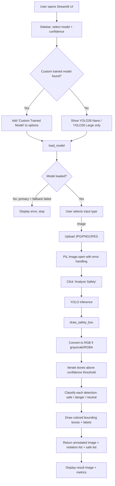
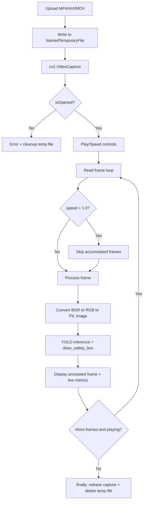
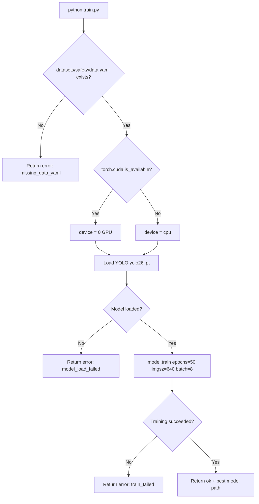

# Hard Head Hat Detection — Computer Vision

Real-time Personal Protective Equipment (PPE) compliance detection system built with YOLO and Streamlit. Detects hardhats, masks, safety vests, and their absence across images, video files, and live webcam feeds.

## Table of Contents

- [Project Overview](#project-overview)
- [Architecture Overview](#architecture-overview)
- [System Flow](#system-flow)
- [Core Modules](#core-modules)
- [Detection Classes](#detection-classes)
- [Model Discovery and Fallback Chain](#model-discovery-and-fallback-chain)
- [Input Validation and Safety](#input-validation-and-safety)
- [Dataset Setup](#dataset-setup)
- [Training Pipeline](#training-pipeline)
- [Quickstart](#quickstart)
- [Running the Application](#running-the-application)
- [Testing](#testing)
- [Project Structure](#project-structure)
- [Limitations](#limitations)
- [License](#license)

---

## Project Overview

This system performs construction site safety compliance analysis by detecting whether workers are wearing required PPE. It classifies 10 object classes into three safety categories and presents per-frame violation/compliance counts through a Streamlit web interface.

**Key capabilities (from code):**

- Single-image upload analysis with annotated bounding box output
- Video file processing with playback speed control (0.25x–2.0x)
- Live webcam inference with real-time annotation
- Automatic model discovery selecting the newest trained weights by modification time
- Three-tier model fallback: custom trained → selected preset → `yolov8n.pt`
- Configurable confidence threshold via sidebar slider (0.0–1.0, default 0.4)
- Input image mode normalization (grayscale and RGBA automatically converted to RGB)

---

## Architecture Overview

The system consists of three standalone Python modules with no shared state between them:

| Module | Role | Entry Point |
|---|---|---|
| `app.py` | Streamlit inference UI — handles all user interaction, model loading, and visualization | `streamlit run app.py` |
| `train.py` | Training pipeline — fine-tunes a YOLO model on the dataset | `python train.py` |
| `data_setup.py` | Dataset preparation — downloads from Kaggle if needed, validates split structure, generates `data.yaml` | `python data_setup.py` |

Supporting configuration:

| File | Purpose |
|---|---|
| `.streamlit/config.toml` | Sets `maxUploadSize = 1000` (MB) for video uploads |
| `datasets/safety/data.yaml` | YOLO dataset config with relative paths, 10 classes |
| `requirements.txt` | All direct dependencies (9 packages) |

---

## System Flow

### Image Inference



### Video Inference



### Training Pipeline



---

## Core Modules

### `app.py` — Functions

#### `get_latest_model_path() → str | None`

Scans two locations for trained `best.pt` files:

1. `datasets/safety/results_yolov8n_100e/kaggle/working/runs/detect/train/weights/best.pt`
2. `runs/detect/safety_model*/weights/best.pt` (glob pattern)

If multiple candidates exist, selects the one with the most recent filesystem modification time (`st_mtime`). Returns the path as a string, or `None` if no candidates found.

#### `load_model(model_name: str, custom_path: str) → tuple[YOLO | None, bool]`

Loads a YOLO model with a multi-stage fallback chain:

| `model_name` value | Primary path | Fallback |
|---|---|---|
| `'Custom Trained Model'` | `custom_path` | `yolov8n.pt` |
| `'YOLO26 Nano'` | `yolo26n.pt` | `yolov8n.pt` |
| `'YOLO26 Large'` | `yolo26l.pt` | `yolov8n.pt` |

Returns `(model_instance, is_custom)`. Returns `(None, False)` when both primary and fallback fail.

#### `draw_safety_box(image, result, conf_threshold, is_custom) → tuple[ndarray, list, list]`

Post-processes YOLO inference output:

1. Validates inputs (`None` raises `ValueError`)
2. Converts image to RGB if mode is not already RGB (handles grayscale `L` and `RGBA`)
3. Iterates detection boxes, filtering by `conf_threshold`
4. In custom mode: classifies each detection via `CLASSES_CONFIG` lookup
5. In non-custom mode: only processes `cls_id == 0` as `"Person"` (neutral)
6. Draws colored bounding boxes and labels onto the image
7. Returns `(annotated_image, violation_reasons, safe_reasons)`

#### `format_reasons(reasons_list: list) → str`

Aggregates duplicate class names using `Counter` and formats as `"NO-Mask (2), NO-Hardhat (1)"`. Returns empty string for empty input.

#### `main()`

Streamlit entry point. Builds the sidebar (model selector, confidence slider), loads the model, then branches into Image / Video / Webcam processing modes.

---

### `train.py` — Functions

#### `train_safety_model() → dict`

Runs a YOLO training job. Returns a structured dict in all code paths:

| Outcome | Return value |
|---|---|
| `data.yaml` missing | `{"ok": False, "error": "missing_data_yaml"}` |
| Model file fails to load | `{"ok": False, "error": "model_load_failed"}` |
| Training raises exception | `{"ok": False, "error": "train_failed"}` |
| Success | `{"ok": True, "best_model": "<path>", "device": <device>}` |

Training configuration (hardcoded):

| Parameter | Value |
|---|---|
| Base model | `yolo26l.pt` |
| Dataset config | `datasets/safety/data.yaml` |
| Epochs | 50 |
| Image size | 640 |
| Batch size | 8 |
| Workers | 2 |
| Output directory | `runs/detect/safety_model` |

---

### `data_setup.py` — Functions

#### `find_folder(root_dir, folder_name) → Path | None`

Recursively searches `root_dir` for a directory named `folder_name` using `rglob`.

#### `find_split_folder(root_dir, split_names) → Path | None`

Searches for dataset split folders that contain **both** `images/` and `labels/` subdirectories. When multiple matches exist, selects the shallowest path (fewest directory components).

#### `setup_data()`

1. Looks for a valid `train` split under `datasets/safety`
2. If absent, downloads from Kaggle: `snehilsanyal/construction-site-safety-image-dataset-roboflow`
3. Requires all three splits: `train`, `valid`/`val`, and `test` — each with `images/` and `labels/`
4. Generates `datasets/safety/data.yaml` with relative paths and `path: .`

---

## Detection Classes

The model recognizes 10 classes, categorized in `CLASSES_CONFIG`:

| Class | Category | Bounding Box Color |
|---|---|---|
| Hardhat | Safe | Green `(0, 255, 0)` |
| Mask | Safe | Green |
| Safety Vest | Safe | Green |
| NO-Hardhat | Danger | Red `(0, 0, 255)` |
| NO-Mask | Danger | Red |
| NO-Safety Vest | Danger | Red |
| Person | Neutral | Blue `(255, 0, 0)` |
| Safety Cone | Neutral | Blue |
| machinery | Neutral | Blue |
| vehicle | Neutral | Blue |

When using a non-custom (pretrained) model, only `cls_id == 0` is processed and displayed as `"Person"` with neutral status.

---

## Model Discovery and Fallback Chain

```
Custom trained best.pt (newest by mtime)
    ↓ (not found or load fails)
Selected preset: yolo26n.pt or yolo26l.pt
    ↓ (load fails)
Fallback: yolov8n.pt
    ↓ (load fails)
None → app displays error and stops
```

Model files expected in workspace root: `yolo26n.pt`, `yolo26l.pt`, `yolov8n.pt`.

---

## Input Validation and Safety

| Check | Location | Behavior |
|---|---|---|
| `image is None` | `draw_safety_box` | Raises `ValueError` |
| `result is None` | `draw_safety_box` | Raises `ValueError` |
| Non-RGB image mode | `draw_safety_box` | Auto-converts via `image.convert('RGB')` |
| Invalid image upload | `main()` Image branch | Catches `UnidentifiedImageError` / `OSError`, shows error |
| Inference exception | `main()` Image branch | Catches `Exception`, shows error |
| Video open failure | `main()` Video branch | Shows error, deletes temp file |
| Video temp file cleanup | `main()` Video branch | `finally` block: `vf.release()` + `Path.unlink()` |
| Webcam cleanup | `main()` Webcam branch | `finally` block: `cam.release()` |
| Confidence filtering | `draw_safety_box` | Boxes below threshold are skipped |

---

## Dataset Setup

The dataset is sourced from Kaggle: [Construction Site Safety Image Dataset (Roboflow)](https://www.kaggle.com/datasets/snehilsanyal/construction-site-safety-image-dataset-roboflow).

**Requirements:**
- Kaggle API credentials (`kaggle.json` or `KAGGLE_API_TOKEN` environment variable)
- Required only if the dataset is not already present at `datasets/safety/`

**Split structure required:**

```
datasets/safety/
└── css-data/
    ├── train/
    │   ├── images/
    │   └── labels/
    ├── valid/
    │   ├── images/
    │   └── labels/
    └── test/
        ├── images/
        └── labels/
```

Each split folder **must** contain both `images/` and `labels/` subdirectories, or `data_setup.py` will reject it.

Run:

```bash
python data_setup.py
```

This generates `datasets/safety/data.yaml` with relative paths (`path: .`).

---

## Training Pipeline

```bash
python train.py
```

- Uses `yolo26l.pt` as the base model
- Reads dataset config from `datasets/safety/data.yaml`
- Automatically selects GPU (device `0`) when CUDA is available; falls back to CPU
- Saves trained weights to `runs/detect/safety_model/weights/best.pt`
- The trained model is automatically discovered by `app.py` on next launch

---

## Quickstart

```bash
# Clone the repository
git clone https://github.com/pypi-ahmad/Hard-head-hat-Detection-Computer-Vision.git
cd Hard-head-hat-Detection-Computer-Vision

# Create and activate virtual environment
python -m venv .venv
# Windows
.\.venv\Scripts\activate
# macOS / Linux
source .venv/bin/activate

# Install dependencies
pip install -r requirements.txt

# (Optional) Download dataset and generate data.yaml
python data_setup.py

# (Optional) Train a custom model
python train.py

# Launch the application
streamlit run app.py
```

### Dependencies

All direct dependencies from `requirements.txt`:

| Package | Purpose |
|---|---|
| `ultralytics` | YOLO model loading, inference, and training |
| `torch` | PyTorch backend for model execution and GPU detection |
| `streamlit` | Web UI framework |
| `opencv-python-headless` | Image/video processing (drawing, color conversion, video capture) |
| `Pillow` | Image loading and mode conversion |
| `numpy` | Array operations for image data |
| `PyYAML` | YAML reading/writing for dataset config |
| `kaggle` | Kaggle API for dataset download |
| `pandas` | Data handling (used in training notebooks) |

---

## Running the Application

```bash
streamlit run app.py
```

**What the user sees:**

1. **Sidebar** — Model selector dropdown, confidence threshold slider (0.0–1.0)
2. **Main area** — Radio button to choose input type: Image, Video, or Webcam
3. **Image mode** — File uploader (JPG/PNG/JPEG) → "Analyze Safety" button → annotated result with violation/safe counts
4. **Video mode** — File uploader (MP4/AVI/MOV, up to 1 GB) → play/pause checkbox → speed slider → real-time annotated frames with live metrics
5. **Webcam mode** — "Start Webcam" checkbox → live annotated feed with violation/safe counts

If no custom trained model is found, the sidebar warns: *"No custom model found"* and only YOLO26 Nano / YOLO26 Large are available. When using a non-custom model, a warning displays: *"Using Standard Model. Only 'Person' detection available."*

---

## Testing

**Framework:** pytest

**Test suite:** 36 tests across 4 categories + a stress harness

| Category | File | Tests | Covers |
|---|---|---|---|
| Unit | `tests/unit/test_app_unit.py` | 15 | `format_reasons`, `get_latest_model_path`, `load_model`, `draw_safety_box` (RGB, grayscale, RGBA, None, confidence filtering, custom/non-custom modes) |
| Unit | `tests/unit/test_train_unit.py` | 4 | CPU/GPU selection, model load failure, missing `data.yaml` branch |
| Unit | `tests/unit/test_data_setup_unit.py` | 5 | `find_folder`, `setup_data` YAML generation, missing val/test splits |
| Integration | `tests/integration/test_pipelines_integration.py` | 4 | End-to-end: data setup → training → inference pipeline |
| ML Behavior | `tests/ml/test_ml_behavior.py` | 8 | Model path selection, prediction shape, fallback chain, grayscale/RGBA handling, unknown classes |
| Stress | `tests/stress/phase4_stress_runner.py` | 13 scenarios | 8K images, 2000 repeated inferences, rapid model reloads, temp file lifecycle, corrupted weights, invalid uploads, batch processing |

Run all tests:

```bash
python -m pytest tests/ -q
```

Run stress scenarios:

```bash
python tests/stress/phase4_stress_runner.py
```

All tests are hermetic — they use `tmp_path`, `monkeypatch`, and fake objects. No network calls, no real model loading, no filesystem side effects.

---

## Project Structure

```
Hard-head-hat-Detection-Computer-Vision/
├── app.py                          # Streamlit inference UI
├── train.py                        # YOLO training pipeline
├── data_setup.py                   # Dataset download + data.yaml generation
├── requirements.txt                # Python dependencies (9 packages)
├── .streamlit/
│   └── config.toml                 # maxUploadSize = 1000 MB
├── datasets/
│   └── safety/
│       ├── data.yaml               # YOLO dataset config (auto-generated)
│       └── css-data/               # Train/valid/test splits with images + labels
├── tests/
│   ├── conftest.py                 # Shared pytest fixtures (fake_streamlit)
│   ├── unit/                       # Unit tests for all three modules
│   ├── integration/                # Pipeline integration tests
│   ├── ml/                         # ML behavior tests
│   └── stress/                     # Stress harness (13 scenarios)
├── yolo26n.pt                      # YOLO26 Nano weights
├── yolo26l.pt                      # YOLO26 Large weights
├── yolov8n.pt                      # YOLOv8 Nano fallback weights
└── LICENSE                         # Mozilla Public License 2.0
```

---

## Limitations

The following constraints are derived from the current implementation:

| Limitation | Evidence |
|---|---|
| Training hyperparameters are hardcoded | `train.py` lines 37–46: epochs, batch, imgsz are constants with no CLI or config override |
| No authentication or access control on the UI | `app.py` exposes the Streamlit interface without any login or session management |
| Non-custom model only detects `cls_id == 0` as Person | `app.py` lines 120–122: all other class IDs are skipped via `continue` |
| Video processing is single-threaded | `app.py` lines 229–250: frame read → inference → display runs sequentially in one loop |
| No batch inference for video frames | Each frame is processed individually through `model(frame_pil)` |
| Webcam mode has no recording/export capability | `app.py` lines 256–273: frames are displayed but not saved |
| Dataset download requires Kaggle credentials | `data_setup.py` lines 64–68: `kaggle.api.authenticate()` must succeed |
| No model versioning or experiment tracking | Trained weights are saved to a fixed path (`runs/detect/safety_model`) |
| `pandas` is listed as a dependency but not imported by any production module | Only used in the Kaggle notebook under `datasets/` |

---

## License

This project is licensed under the [Mozilla Public License 2.0](LICENSE).

Dataset: [Construction Site Safety (Roboflow)](https://universe.roboflow.com/roboflow-universe-projects/construction-site-safety) — CC BY 4.0.
